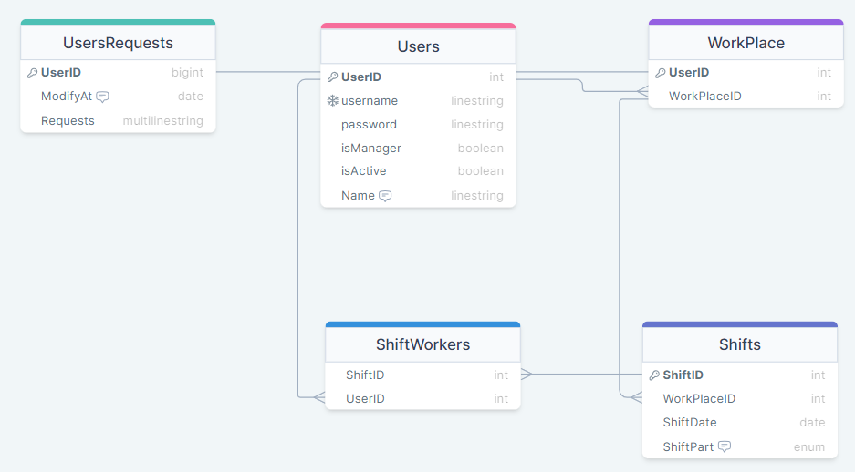

# DB_APP

https://drawsql.app/teams/ca-ate/diagrams/users



## Overview

This folder contains the code for a database application that interacts with a **MySQL** database containing 5 models.

## Setup check
It is recommended to run the main when `check_setup()` is active. It'll set all DBs and will check that the system works.

---

## Model Information

1. **User:** Stores user information (username, password, name, manager status, active status).
2. **WorkPlace:** Associates workplaces with users.
3. **UserRequests:** Captures user shift requests.
4. **Shifts:** Represents shifts, including workplace, date, and part.
5. **ShiftWorkers:** Records shifts assigned to workers.

---

## Generic Structure for Each Model
**1. Repository:**
   * Located in `db/repositories`.
   * Handles database operations (CRUD) specific to the model.
   * Implements methods for creating, reading, updating, and deleting model instances.

**2. Service:**
   * Located in `db/services`.
   * Contains more complex operations involving the model.
   * Interacts with the corresponding repository to perform data operations.

**3. Controller:**
   * Located in `controllers`.
   * A clean class responsible for handling user input and making calls to methods in both the service and repository.
   * Ensures a consistent interface for interaction with the model

---

## Examples
### Adding a User

To add a new user to the system, you can use the provided `UserController` and `UserRepository` classes. Here's a step-by-step example:

```python
# Import necessary modules
from Backend.controllers.users_controller import UsersController

# Assuming db exsits
db = ...

# Initialize UserController and UserRepository
user_controller = UsersController(db)

# Define user data
new_user_data = {
    "username": "john_doe",
    "password": "secret_password",
    "isManager": False,
    "isActive": True,
    "name": "John Doe"
}

# Use UserController to add the user
created_user = user_controller.create_entity(new_user_data)
print("User added successfully:", created_user)
```

### Get a User(s)
```python
# Use UserController to get a list of users
all_user_list = user_controller.get_all_entities()
print("All Users:", all_user_list)

# Get a specific user by its ID
user_id = ...
specific_user = user_controller.get_entity(user_id)
print("User found successfully:", specific_user)
```

### Update user details and delete a user
```python
# Define new details
new_user_data = {
    "username": "john_doe",
    "password": "new_password",  # Updated
    "isManager": False,
    "isActive": True,
    "name": "John Doe"
}

user_id = ...

# Updated the wished user details
updated_user = user_controller.update_entity(user_id, new_user_data)

user_id = ...

# Delete a user by its ID
deleted_user = user_controller.delete_entity(user_id)
```