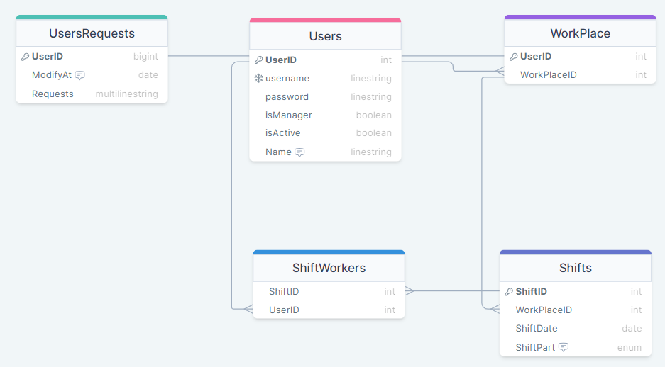

# DB_APP

https://drawsql.app/teams/ca-ate/diagrams/users



## Overview

This folder contains the code for a database application that interacts with a **MySQL** database containing 5 models.

## Setup check
It is recommended to run the main when `check_setup()` is active. It'll set all DBs and will check that the system works.

## Model Information

1. **User:** Stores user information (username, password, name, manager status, active status).
2. **WorkPlace:** Associates workplaces with users.
3. **UserRequests:** Captures user shift requests.
4. **Shifts:** Represents shifts, including workplace, date, and part.
5. **ShiftWorkers:** Records shifts assigned to workers.

## Controllers, Repositories and Services

### Controllers

Controllers handle the interaction between the user interface and the application logic. They receive user input, process it, and update the model accordingly. Specific controllers (e.g., `UserController`, `WorkPlaceController`) inherit from a base controller (`BaseController`), providing common operations and ensuring a consistent interface.

### Repositories

Repositories handle database operations for each model. They encapsulate CRUD (Create, Read, Update, Delete) operations and ensure clean separation between the database and the rest of the application. Specific repositories (e.g., `UserRepository`, `WorkPlaceRepository`) inherit from a base repository (`BaseRepository`), which provides generic methods for database interactions.

### Services

Services contain business logic that may involve multiple models or complex operations. They interact with repositories to perform data operations and provide a higher-level abstraction for application functionality. Specific services (e.g., `UserService`, `WorkPlaceService`) inherit from a base service (`BaseService`), which provides a common structure for service classes.

## Example: Adding a User

To add a new user to the system, you can use the provided `UserController` and `UserRepository` classes. Here's a step-by-step example:

```python
# Import necessary modules
from DB_APP.controllers.users_controller import UsersController

# Assuming db exsits
db = ...

# Initialize UserController and UserRepository
user_controller = UsersController(db)

# Define user data
new_user_data = {
    "username": "john_doe",
    "password": "secret_password",
    "isManager": False,
    "isActive": True,
    "name": "John Doe"
}

# Use UserController to add the user
created_user = user_controller.create_entity(new_user_data)
print("User added successfully:", created_user)
```

